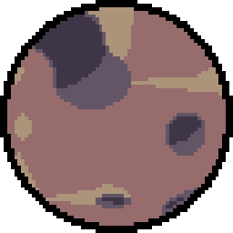

# Asteritos

  

Entry for the [Gosu Game Jam 5](https://itch.io/jam/gosu-game-jam-5). It's a simple [Asteroids](https://en.wikipedia.org/wiki/Asteroids_(video_game)) clone.
While the core concept of asteroids is in the game it does have some different design choices here and there.

  

## Requirements

- A PC, either Windows, MacOS or Linux.
- Keyboard and mouse.
- A CPU, and GPU.
- Sound card.

That's it, it's not a particularly taxing game at all :).

## Controls

This game is played with a keyboard, menu navigation can be done with both mouse and keyboard.

<kbd>W</kbd> <kbd>A</kbd> <kbd>S</kbd> <kbd>D</kbd> or <kbd>↑</kbd> <kbd>←</kbd> <kbd>→</kbd> <kbd>↓</kbd> - Movement

<kbd>Space</kbd> - Shoot

<kbd>Enter</kbd> - Pause

<kbd>Escape</kbd> - Close the game

## How To Play

### Download

Either download the game from the [releases](https://github.com/Chadowo/asteritos/releases) here on GitHub or from the [itch.io page](https://chadow.itch.io/asteritos).

If you want to run the game from the source code, then do the following:

1. Download [Ruby](https://www.ruby-lang.org/) for your platform ([Windows](https://rubyinstaller.org/), [MacOS](https://www.ruby-lang.org/en/documentation/installation/#homebrew) or [Linux](https://www.ruby-lang.org/en/documentation/installation/#apt)).
2. Install all the requirements for Gosu ([MacOS](https://github.com/gosu/gosu/wiki/Getting-Started-on-OS-X#prerequisites) or [Linux](https://github.com/gosu/gosu/wiki/Getting-Started-on-Linux#dependencies)).
3. Invoke `bundle install` on the root of this repo, and then `rake` to run the game.

## License

### Assets

[CC BY 4.0](https://creativecommons.org/licenses/by/4.0/) unless noted otherwise.

### Code

[MIT license](LICENSE).

## Credits

Nordine Font - [Liam Moniez](https://www.behance.net/agraffs) - [OFL 1.1 license](/assets/fonts/nordine/license.txt)
